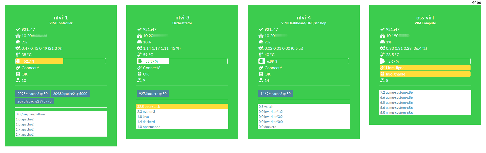

# shepherd
Monitoring tool for Linux clusters



## Agent

The agent can be installed on the node by cloning this repo and running the **native** reporting daemon *(not yet included in that repo)*

```
git clone https://github.com/mortrevere/shepherd.git
```

By default it reports :

- Management IP address
- disk usage
- CPU load
- Temperature
- RAM usage
- Internet connectivity
- DNS resolving
- Exposed webservices
- Top 5 processes

## Middleware

Data from nodes is collected and aggregated by the python middleware

```
./shepherd.py
```

## Dashboard

The dashboard is accessible by opening the `index.html` file directly in your browser (Ctrl-O) or by hosting it somewhere.


